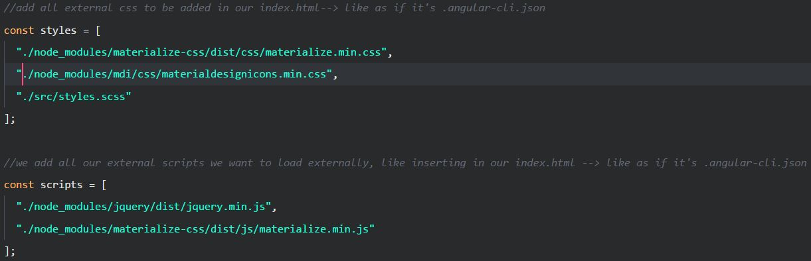

[](https://angular.io/) [](https://electron.atom.io/)


[](http://makeapullrequest.com)
[](https://github.com/MISTERSOFT/angular-electron-lazy-loading-scaffold/blob/master/LICENSE.md)
[](https://github.com/MISTERSOFT/angular-electron-lazy-loading-scaffold/issues)
[](https://github.com/MISTERSOFT/angular-electron-lazy-loading-scaffold/watchers)
[](https://github.com/MISTERSOFT/angular-electron-lazy-loading-scaffold/stargazers)

# Note

This project is a fork of [Angular-Electron](https://github.com/maximegris/angular-electron) with few changes. I added Lazy Loading with some ready to use base Modules (Core, Shared, Dashboard) and Components that are used in many common Angular projects using Lazy loading. Also I added:
* [Materialize CSS Framework](http://materializecss.com/)
* [Ng2-Materialize](https://www.npmjs.com/package/ng2-materialize) : An Angular wrapper for Materialize that allow you to use Components/Directives instead of HTML tags.
* [Material Design Icons](https://materialdesignicons.com/) : An alternative to Google Icons with more icons made by the community.

<span style="color:#e74c3c;">Important things:</span>
* If you want to add third-party libraries, you have to add your scripts in the **wepack.config.js** and **.angular-cli.json** files. Like so:



# Introduction

Bootstrap and package your project with Angular 5(+) and Electron (Typescript + SASS + Hot Reload) for creating Desktop applications.

Currently runs with:

- Angular v5.0.1
- Angular-CLI v1.5.0
- Electron v1.7.6
- Electron Packager v9.0.1

With this sample, you can :

- Run your app in a local development environment with Electron & Hot reload
- Run your app in a production environment
- Package your app into an executable file for Linux, Windows & Mac

## Getting Started

Clone this repository locally :

``` bash
git clone https://github.com/MISTERSOFT/angular-electron-lazy-loading-scaffold.git
```

Install dependencies with npm or yarn :

``` bash
# Using npm
npm install

# Using yarn
yarn
```

There is an issue with `yarn` and `node_modules` that are only used in electron on the backend when the application is built by the packager. Please use `npm` as dependencies manager.

If you want to generate Angular components with Angular-cli , you **MUST** install `@angular/cli` in npm global context.  
Please follow [Angular-cli documentation](https://github.com/angular/angular-cli) if you had installed a previous version of `angular-cli`.

``` bash
# Using npm
npm install -g @angular/cli

# Using yarn
yarn global add @angular/cli
```

## To build for development

- **in a terminal window** -> npm start  

Voila! You can use your Angular + Electron app in a local development environment with hot reload !

The application code is managed by `main.ts`. In this sample, the app runs with a simple Electron window and "Developer Tools" is open.  
The Angular component contains an example of Electron and NodeJS native lib import. See [Use NodeJS Native libraries](#use-nodejs-native-libraries) charpter if you want to import other native libraries in your project.  
You can desactivate "Developer Tools" by commenting `win.webContents.openDevTools();` in `main.ts`.

## To build for production

- Using development variables (environments/index.ts) :  `npm run electron:dev`
- Using production variables (environments/index.prod.ts) :  `npm run electron:prod`

Your built files are in the /dist folder.

## Included Commands

|Command|Description|
|--|--|
|`npm run start:web`| Execute the app in the brower |
|`npm run electron:linux`| Builds your application and creates an app consumable on linux system |
|`npm run electron:windows`| On a Windows OS, builds your application and creates an app consumable in windows 32/64 bit systems |
|`npm run electron:mac`|  On a MAC OS, builds your application and generates a `.app` file of your application that can be run on Mac |

**Your application is optimised. Only the files of /dist folder are included in the executable.**

## Use NodeJS Native libraries

Actually Angular-Cli doesn't seem to be able to import nodeJS native libs or electron libs at compile time (Webpack error). This is (one of) the reason why webpack.config was ejected of ng-cli.
If you need to use NodeJS native libraries, you **MUST** add it manually in the file `webpack.config.js` in root folder :

```javascript
  "externals": {
    "electron": 'require(\'electron\')',
    "child_process": 'require(\'child_process\')',
    "fs": 'require(\'fs\')'
    ...
  },
```

Notice that all NodeJS v7 native libs are already added in this sample. Feel free to remove those you don't need.

## Browser mode

Maybe you want to execute the application in the browser (WITHOUT HOT RELOAD ACTUALLY...) ? You can do it with `npm run start:web`.  
Note that you can't use Electron or NodeJS native libraries in this case. Please check `providers/electron.service.ts` to watch how conditional import of electron/Native libraries is done.

## Execute E2E tests

You can find end-to-end tests in /e2e folder.

You can run tests with the command lines below : 
- **in a terminal window** -> First, start a web server on port 4200 : `npm run start:web`  
- **in another terminal window** -> Then, launch Protractor (E2E framework): `npm run e2e`

